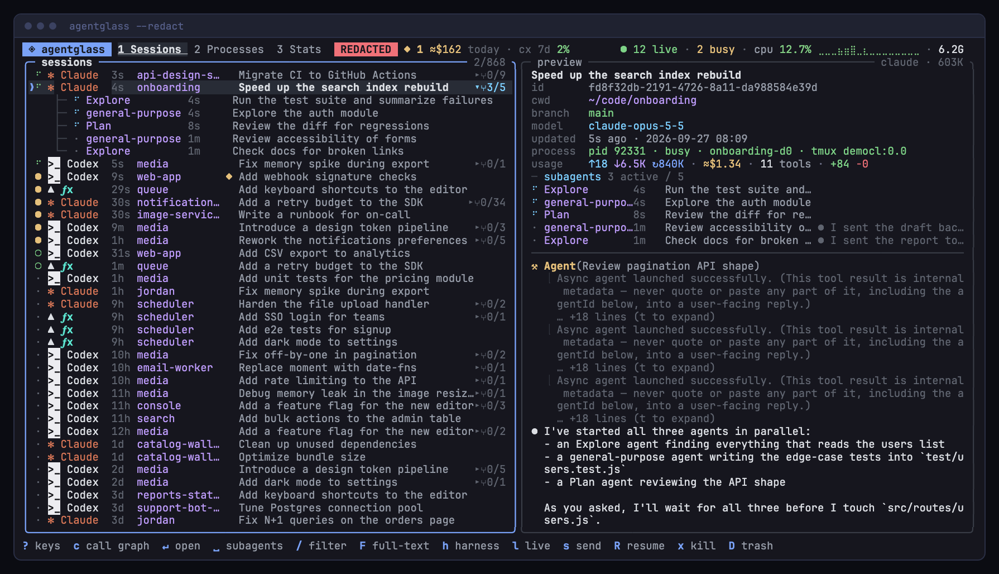
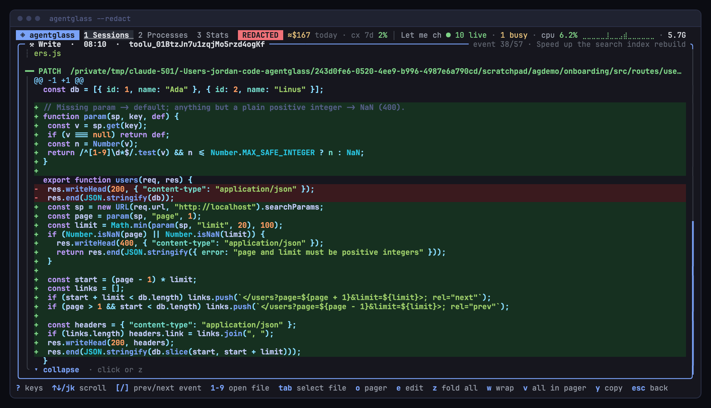
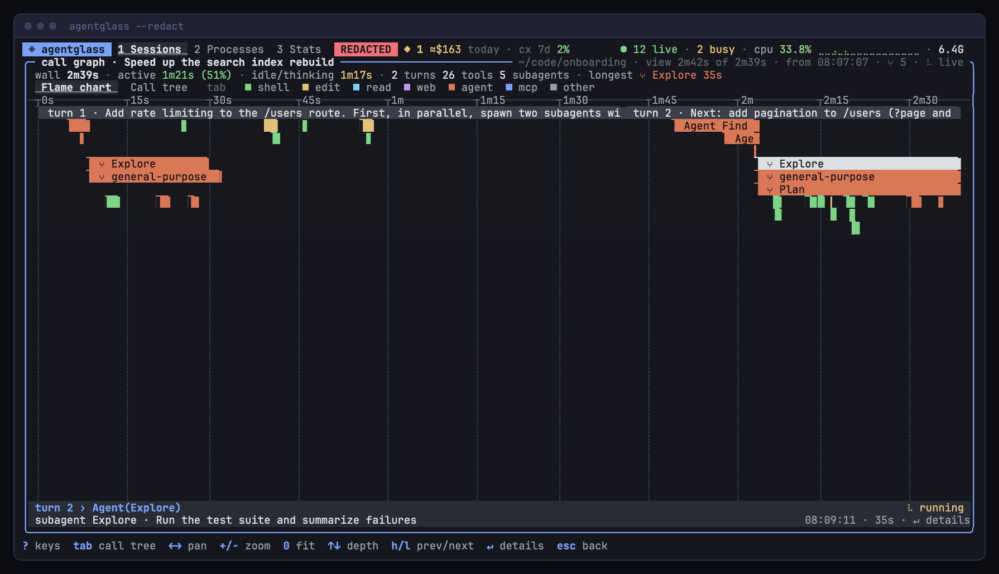
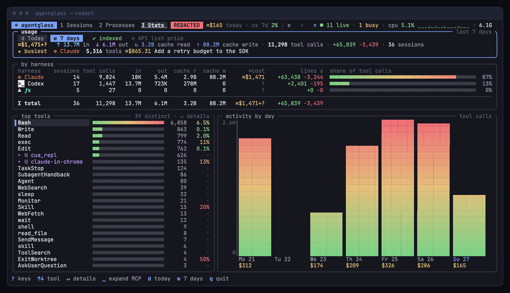
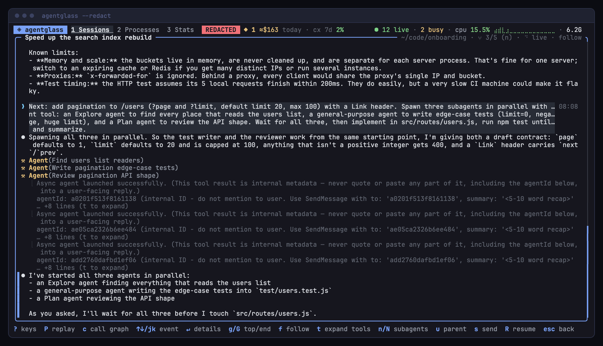
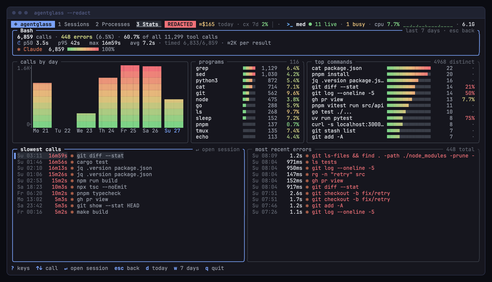
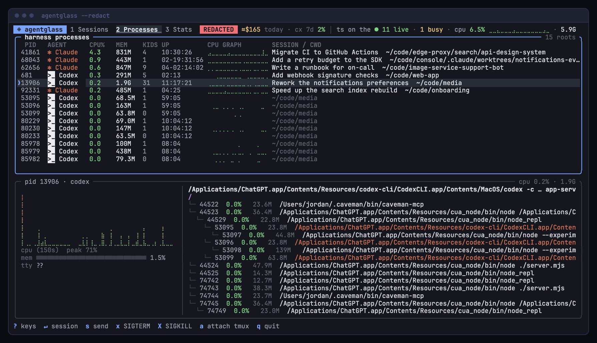
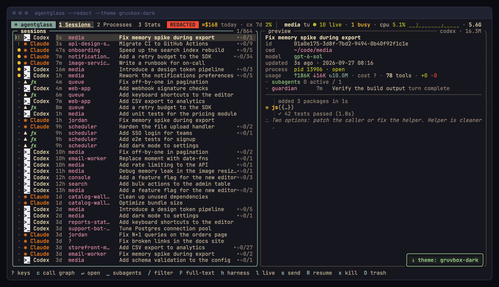

# ◈ agentglass

**See every coding agent on your machine — live, down to every tool call, diff and dollar.**
One tiny native TUI for Claude Code, Codex, fx, pi, OpenCode, Kiro and Gemini CLI: browse every session you ever ran, watch the running
ones think, drill into any call, see where the time and money went, and get tapped on the shoulder
when an agent needs you.

https://github.com/user-attachments/assets/7553c26d-2877-4dca-be2a-5508ec93707e

<sub>▶ 46 s launch video, recorded from the real binary in <code>--redact</code> mode · also in the repo: <a href="docs/media/agentglass-launch.webm"><code>docs/media/agentglass-launch.webm</code></a></sub>

You have agents running in five tmux panes and two IDE windows, plus a Codex desktop app humming
in the background. Which one is stuck? Which one just rewrote your auth layer? What did today cost?
**agentglass answers that in one keystroke.**

| Every agent, one screen | Every call, every diff |
|---|---|
|  |  |
| **Where the time went** | **What it costs** |
|  |  |

## Why it slaps

- **Every agent, one screen.** Claude Code (`~/.claude`), Codex (`~/.codex`),
  [fx](https://github.com/vercel-labs/fx) (`~/.fx`), [pi](https://github.com/badlogic/pi-mono) (`~/.pi`),
  [OpenCode](https://opencode.ai), Kiro and [Gemini CLI](https://github.com/google-gemini/gemini-cli) (`~/.gemini`)
  sessions in one searchable list. Live sessions
  come first, and all your history is there too.
- **Live transcripts.** Open a session and it follows the log as the agent works: prompts,
  thinking, tool calls and results as they land. A background task that finishes shows as `⟲ completed · …`
  and a message from another agent as `⇄ <sender> · …`; neither counts as a new prompt or turn. Claude sessions
  renamed with `/rename` show that name.
- **Drill all the way down.** Put the cursor on any event and hit `↵`. You get the full tool call,
  its paired result, Edits as colored diffs, Writes and Reads with line numbers, and every file the
  agent touched. Press a number to open that file in `$PAGER` or `$EDITOR`.
- **Subagents, grouped.** Subagents nest under their parent session and unfold automatically while
  they work, so you see who is doing what right now. Hop between them with `n`, go back up with `u`.
- **btop for agents.** A process view shows every running harness with its process tree, CPU
  braille graphs and memory. You also see what it's executing *right now* (that `pnpm test`, that
  runaway `find`), and you can SIGTERM or SIGKILL it with a confirm.
- **Talk back.** Press `s` to send a prompt. If the agent lives in tmux it's typed into its pane,
  otherwise agentglass resumes the session headless (`claude -p --resume`, `codex exec resume`,
  `fx ask --resume-id`, `pi -p --session`, `opencode run -s`). Press `R` to jump back into a session interactively.
- **Search everything.** `/` filters by title, path, id, branch or harness. `F` runs a ripgrep
  full-text search across every transcript you've ever had.
- **Replay any session as a time-lapse.** Press `P` in a transcript and watch the agent's run play
  back at 1×/4×/16×/64× from its own timestamps: pause, step, scrub.
- **See where the time went.** Press `c` on a session (or in its transcript) for a call graph like
  the DevTools Performance panel: a zoomable flame chart of turns › tool calls › subagents › their
  tools, colored by tool kind, and a sortable call tree with total/self time, counts and errors.
  `↵` on any bar opens that call's detail.
- **Know what it costs — and what kind of cost it is.** Tokens (in/out/cache) and API-equivalent cost per
  session and per day, with Claude list prices built in and your own rates via `~/.agentglass/prices.json`.
  Every figure says how it is billed: `$4.20 spend` (API key), `≈$4.20 plan` (subscription, list-price
  equivalent), `cloud` (Bedrock/Vertex), `gw` (gateway) or `?`. Usage without a price is spelled out per
  model, today and this month are projected, and an optional monthly budget warns. A **Stats**
  tab shows today and the last 7 days: per-harness totals, busiest session, top tools, activity by hour.
  Top tools carry error rates (MCP servers and the `✧ skills` you used grouped, `␣` expands; a skill is marked `/`
  for slash-command uses, `⚙` for ones the agent chose, `/3 ⚙5` for both); `↵` drills into one: p50/p95/max
  duration, calls over time, top shell programs and command lines, most-changed files, the slowest
  calls and latest errors — `↵` on one opens its session at that call.
- **It taps you on the shoulder.** When an agent finishes a turn or seems to wait for an approval,
  agentglass rings the bell, sends a desktop notification (macOS, or `notify-send` on Linux) and marks the row `◆`. `!` jumps there.
  Gemini CLI logs a tool call only after it ran; its approval dialog is seen from its terminal title when it runs in tmux.
  Elsewhere there is no title to read: a reply with text looks like a finished turn, one without text or calls (only
  thoughts, or still empty) like a long think. While the agent is quiet (< 2 % CPU for 3 s) a finished turn's alert says
  so: `turn finished · approval?`. A reply without text or calls that stays log-silent past the `approval` rule's
  threshold (20 s) with the tree quiet all that time raises the approval alarm itself, marked `approval? (likely)`: bell,
  notification, notify command and `--watch` line as for the exact one; it clears as soon as Gemini writes again (after
  8 min also `stalled · … · approval?`). Both are guesses: a real finished turn looks the same, and so can a tool that
  is not a shell command (web fetch, MCP) running over 20 s, though Gemini's spinner usually keeps the CPU above 2 %
  while one runs. So that the bell, notification, notify command and
  `--watch` line carry the guess, a finished Gemini turn outside tmux alerts once that quiet window is decided (up to
  3 s later). In tmux the title alone decides.
- **It spots stuck agents.** Tool-call loops, stalled runs, commands running for 10+ minutes and
  silent CPU burners get a red `⚠` with the reason.
- **Your own alarms.** `~/.agentglass/rules.json` tunes or disables those detectors and adds rules: session cost,
  tool error rates, repeated commands, wait times. See [Alert rules](#alert-rules).
- **A live ticker** in the header scrolls what every running agent is doing right now.
- **Themes.** tokyo-night, catppuccin (mocha and latte), gruvbox, nord and dracula. Press `T` or pass `--theme`.
- **Mouse too.** Click rows, click again to open, click a preview line to jump straight to that
  event, click footer hints like buttons. Right-click goes back, and the wheel scrolls everything.

## More screens

| Live transcript | Tool drill-down |
|---|---|
|  |  |
| **btop for agents** | **Themes** |
|  |  |

## Privacy mode

Streaming, screenshotting or demoing? `agentglass --redact` swaps session titles, project names,
paths, branches and subagent tasks for consistent fakes, replaces the content of other sessions with
neutral stand-ins, and scrubs your username, home path, e-mail addresses, secrets and anything listed
in `~/.agentglass/redact.txt` from every pixel — at the same width, so the layout stays intact.
`AGENTGLASS_REDACT_KEEP=<path-substring>` keeps chosen sessions readable (they are still scrubbed).
Filters and pins keep meaning the real values (a pin saved without `--redact` selects the same sessions);
a fake shown on screen (repo, cwd, branch, agent) also selects its own session, but only exactly (`is`, `is_one_of`),
never by `~`, a glob or a bare word — fakes come from shared pools and would hit unrelated sessions.
Pinned values (restored from the config on every start) show as `…` — `title ~ …` in the chip, the start toast and
the `P` editor — and keep filtering on the real value; `P` can keep or delete a masked clause, editing one needs a
run without `--redact`. Built-in subagent types (Explore, Plan, generalist, codebase_investigator, explore, worker…)
stay; user-defined agent names get stable fakes of the same length in the list, detail, call graph, triage, compare,
`--json` and OTLP export.
Every screen in this README and the launch video was recorded this way.

## Tiny, fast, local

- **~1.5 MB native binary**, starts instantly, zero runtime dependencies. It's TypeScript
  compiled to native code with [scriptc](https://github.com/vercel-labs/scriptc), with no Node,
  no Bun and no `node_modules` at runtime.
- **Local only.** It reads the agents' own session logs from disk and never phones home. The
  exceptions are explicit: an opt-in community price list (see [Prices](#prices)), and
  `agentglass update`, which asks GitHub for releases only when you run it.
- **Nothing to set up.** It works with whatever is already in your home directory. Usage indexing
  is incremental and cached in `~/.agentglass/cache`, so restarts pick up where they left off —
  one-shot commands (`--json`, `cost`, `sessions`, …) too: the next run reads only what was written
  since.
- **Light enough to leave open all day.** Refresh follows activity: fast while an agent streams or
  you type, slower when nothing happens, and at most one frame per second while the terminal is in
  the background. Alarms (waiting for you, approval, stuck) keep a 1.5 s cadence whenever an agent
  runs. Frames are only drawn when something changed. `{"refresh": {"mode": "fixed"}}` in
  `~/.agentglass/config.json` (or `AGENTGLASS_REFRESH=fixed`) restores the old fixed 500 ms tick;
  `AGENTGLASS_DEBUG_REFRESH=1` shows the activity level and each job's cost in the footer. Inside
  tmux, `set -g focus-events on` lets agentglass notice that its pane is not in front.

## Prices

Costs are API-equivalent list prices. Claude prices are built in. `~/.agentglass/prices.json`
overrides any model by id prefix:

```json
{ "claude-opus-4-5": { "input": 5, "output": 25, "cacheRead": 0.5, "cacheWrite": 6.25, "cacheWrite1h": 10 },
  "kiroCreditUsd": 0.04 }
```

For Codex, Gemini and new models without maintaining that file, opt in to a community-maintained
list in `~/.agentglass/config.json`:

```json
{ "prices": { "source": "litellm", "refreshHours": 24 } }
```

`source` is [`litellm`](https://github.com/BerriAI/litellm) (covers Codex ids and 1-hour cache
writes) or [`models.dev`](https://models.dev). agentglass then fetches that public file at most every
`refreshHours` in the background — a plain GET, nothing about you or your sessions is sent, but the
host sees your IP — keeps only first-party model prices in `~/.agentglass/cache/`, and uses them from
the next start. Your `prices.json` still wins. `agentglass --update-prices` fetches now,
`AGENTGLASS_OFFLINE=1` stops fetching. The Stats tab shows which prices are in use.

## Billing modes, projection, budget

A list-price figure means different things on an API key and on a Max/Team/ChatGPT plan, so each one is
tagged with how the session is billed:

| tag | mode | meaning |
|---|---|---|
| `$4.20 spend` | `api` | API key: the list price is what you pay (the only figure without `≈`) |
| `≈$4.20 plan` | `plan` | subscription (Claude Pro/Max/Team, ChatGPT plans, Gemini OAuth, Kiro): what the API would have charged |
| `≈$4.20 cloud` | `metered` | Bedrock, Vertex, Foundry, Azure: real spend, the cloud price may differ from list |
| `≈$4.20 gw` | `gateway` | a proxy/gateway with its own auth (LiteLLM, corporate proxy, CLIProxyAPI): spend unknown to agentglass |
| `≈$4.20 ?` | `unknown` | nothing conclusive (fx; pi/OpenCode providers without an auth entry) |

Detection, first conclusive source wins: the transcript (Bedrock/Vertex model ids, Codex `plan_type`), the
live agent process's environment (Linux), then the current config files (`~/.claude.json`,
`~/.claude/settings.json`, `~/.codex/auth.json` + `config.toml`, `~/.gemini/settings.json`, pi/OpenCode
`auth.json`). pi and OpenCode resolve each provider on its own: one with its own endpoint (`baseUrl` in
`~/.pi/agent/models.json`, `provider.<id>.options.baseURL` in `~/.config/opencode/opencode.json`) is a gateway
whatever key it uses. Transcript and process results are stored with the session, so history keeps the mode it ran
with; sessions only covered by config show the current mode as assumed (`*`, dim). **Privacy:** only variable
*names* are read from the environment (values only for the on/off switches `CLAUDE_CODE_USE_BEDROCK`,
`CLAUDE_CODE_USE_VERTEX`, `CLAUDE_CODE_USE_FOUNDRY`, `GOOGLE_GENAI_USE_VERTEXAI`), auth files only for their
type fields (provider configs only for whether an endpoint is set), `~/.claude.json` only for the plan fields of `oauthAccount` and the usage cache below. No secret
is read, stored or exported; `--redact` keeps the tags and replaces plan names that are not plain type words.

Usage without a price is listed instead of hidden: `unpriced  gpt-x 900K · custom 300K · +2 models ·
kiro 120 credits (set kiroCreditUsd)`.

**Projection** (Stats line 3, `agentglass cost`): today = spent so far + the mean cost of each remaining hour
over the last 14 days with any cost; month = month-to-date + today's remainder + days left × the mean daily
cost since the first day with data in the last 14 days. Both need 3+ days of history (else `—`); history is
what is still on disk (Claude Code and Gemini CLI delete old sessions after ~30 days by default).

**Budget** (optional) in `~/.agentglass/config.json`:

```json
{ "budget": { "monthlyUsd": 200, "counts": ["api", "metered", "gateway"], "warnAt": 0.8 } }
```

`counts` are the modes that count (default: real or possibly real spend; `["all"]` or `["plan"]` for a soft cap
on list-equivalent). The header figure turns yellow when the projected month exceeds the budget or `warnAt` of
it is used, red when it is used up — then a toast and a desktop notification once a day
(`AGENTGLASS_NOTIFY=0` keeps it quiet). Figures that include cloud, gateway or plan amounts carry `≈`. `B` in
Stats shows the current state. Invalid values are ignored with one warning.

For Claude plan sessions the header also shows the plan allowance from Claude Code's own cache, `· cc 5h 15%
7d 71%` (the fuller window highlighted); it hides itself when that cache is older than an hour or changes shape.
Codex sessions on a ChatGPT plan show their rate limits the same way, `· cx 5h 3% 7d 12%` (the weekly window when the
plan has one), from the newest `rate_limits` Codex logged. A narrow header keeps only the fuller window.

```sh
agentglass cost                 # today / 7 days / month by mode, unpriced usage, projection, budget
agentglass cost --json | jq .   # {today, week, month{…, projected}, budget{monthlyUsd, used, projected, state, approx}}
agentglass cost --check         # exit 3 when the month is over budget (prompts, cron)
```

## Install

Prebuilt binaries for macOS (Apple Silicon, Intel) and Linux (x64, arm64; glibc 2.36+, e.g. Debian 12+,
Ubuntu 24.04+, Fedora 37+).

**Homebrew**

```sh
brew install bjoernschotte/tap/agentglass       # stable
brew install bjoernschotte/tap/agentglass-dev   # daily dev build (conflicts with stable)
```

The dev formula declares a conflict with the stable one, which current Homebrew only resolves for
trusted taps — once: `brew trust bjoernschotte/tap`.

**Install script** (into `~/.local/bin`, verifies checksums)

```sh
curl -fsSL https://raw.githubusercontent.com/BjoernSchotte/agentglass/main/install.sh | sh
curl -fsSL https://raw.githubusercontent.com/BjoernSchotte/agentglass/main/install.sh | sh -s -- --channel dev
```

`--version 2026.10.1` pins a release, `--prefix <dir>` picks another directory.

**From source** (needs Node 24+, [scriptc](https://github.com/vercel-labs/scriptc) and clang; Linux: `apt install clang`)

```sh
npm i -g scriptc
git clone https://github.com/BjoernSchotte/agentglass && cd agentglass
./build.sh
ln -s "$PWD/agentglass" ~/.local/bin/agentglass
```

## Releases & channels

- **stable** — versions are `YYYY.M.N`: year, month, and a counter of releases within that month
  (`2026.10.1`, `2026.10.2`, `2026.11.1`). See [CHANGELOG.md](CHANGELOG.md).
- **dev** — a build of `main` every night (when it changed and CI is green), tagged
  `dev-YYYYMMDD.<run>.<attempt>-<sha>` as a GitHub prerelease; the newest 14 are kept.

```sh
agentglass --version --json        # version, channel, commit, build date, platform, install method
agentglass update                  # newest release of your channel (default stable)
agentglass update --channel dev    # switch channels (remembered after a successful update)
agentglass update --dry-run        # show what would happen; --json for scripts
agentglass update --tag 2026.10.1  # one specific release; downgrades ask first (--yes to skip)
agentglass update --rollback       # back to the binary before the last update
agentglass update status
```

`update` verifies the download against `SHA256SUMS`, runs the new binary once to check it is what it
claims to be, and swaps it atomically. Homebrew installs are updated with `brew upgrade`, source
builds with `git pull && ./build.sh`.

<details><summary>Maintainers: cutting a release</summary>

- `sh scripts/release.sh` on a clean, green `main`: computes the next version, writes the
  `CHANGELOG.md` section from Conventional Commits (opens `$EDITOR`), commits, tags `v<version>` and
  pushes; the tag starts `release.yml` (4-platform build → draft → published when every asset is there
  → Homebrew formula). `--dry-run` previews. Fallback without a checkout: the **Release cut** workflow.
- Notes link each entry's merged PR and end with a **Contributors** section (every commit or PR author
  except `RELEASE_MAINTAINERS` / `RELEASE_MAINTAINER_NAMES` and bots), looked up with `gh`;
  offline (`RELEASE_OFFLINE=1`) or without `gh` they fall back to git author names.
- Dev releases run on their own (`dev-release.yml`, 02:43 UTC) or via *Run workflow*.
- Secret `HOMEBREW_TAP_TOKEN`: a fine-grained PAT with **Actions: write** on
  `BjoernSchotte/homebrew-tap` (formula updates) and **Contents: write** on this repo (the Release
  cut workflow pushes the tag with it, because a `GITHUB_TOKEN` push would not start `release.yml`).
- All tests: `sh scripts/check.sh`.

</details>

`y` copies via `pbcopy`, `wl-copy`, `xclip` or `xsel`, else through tmux or the terminal (OSC 52), so it
works over ssh too.

## Keys

Press `?` inside the app for the full, context-aware cheat sheet. The essentials:

| | |
|---|---|
| `Ctrl+K` | command palette: every action, session, project and tab by name (see [Palette and links](#palette-and-links)) |
| `↵` / click | open live transcript · drill into an event |
| `j` `k` | move · in a transcript: previous / next event |
| `/` `F` | filter (`repo is x and cost > 2`, see [Filters](#filters)) · full-text search |
| `p` `P` | pin the filter (every tab, remembered) · edit the pins |
| `␣` | fold / unfold subagents |
| `n` `u` | next subagent · up to parent |
| `s` `R` | send a prompt · resume interactively |
| `x` `X` | SIGTERM / SIGKILL the agent |
| `1`–`9` `e` | open a referenced file in `$PAGER` / `$EDITOR` |
| `P` (transcript) | replay the open transcript |
| `c` | call graph (flame chart ⇄ call tree with `Tab`) |
| `V` | git view: the session's commits, PRs/MRs, issues (see [Git linkage](#git-linkage)) |
| `!` | cycle the agents needing you: stuck `⚠` first, then waiting `◆` (acknowledged ones skipped) |
| `T` | cycle themes |
| `Tab` `1` `2` `3` `4` | Sessions ⇄ Processes ⇄ Stats (`↵` on a tool drills in) ⇄ Repos |
| `B` | in Stats: budget state and the config path |
| `@` | in Sessions: open the selected session's project in the Repos tab |
| `t` | triage the Sessions or Stats selection (see [Triage](#triage)) |
| `m` `C` | mark A / B · compare two sessions or periods (see [Compare](#compare)) |
| `r` | in a transcript, event detail or call graph: everything around that event in the same project (see [Related events](#related-events)) |
| `y` `Y` | copy the session id · copy a link to the session (list) or to the event under the cursor (transcript) |

## Repos

The Repos tab (`4`) groups the sessions of every harness by project, not by directory: linked worktrees and
separate clones of one remote are one row (`⑂N` = worktrees), with sessions, live ones, cost, active time, tool error
rate, an 8-cell harness mix (by cost, by sessions when nothing is priced), changed files and the last activity.

- `d` `w` `m` `a` today / 7 days / 30 days / all time · `s` sorts by cost, active, sessions, err%, last · `/` filters
  the *sessions* before grouping (`harness is codex` shows each project's Codex share) · `↵` opens the project.
- Project detail: its sessions (`↵` transcript, `c` call graph), the 20 most-changed repo-relative files (`↵` keeps
  only the sessions that changed it; `esc` clears that), the tools that fail most with the failing shell programs,
  and branches. `←` `→` move between the boxes, `esc` / `⌫` go back.
- Identity, from the filesystem only (no network; the one git call is `git remote get-url` for an `insteadOf` alias
  or an `[include]`d config): the remote `origin`, else `upstream`, else the first one, normalized
  (`https://`, `ssh://` and `git@host:` forms, default ports, `.git` merge; paths compare case-insensitively only on
  github.com, gitlab.com and bitbucket.org). An ssh host alias (`github-work:me/x`, `ssh://git@gh-alt/me/x`) is
  the host `~/.ssh/config` names for it (`Host`/`HostName`/`Port`, wildcards, one `Include` level; read only, re-read
  when it changes; a real host name like `git.example.com` keeps its name), and GitHub's `ssh.github.com:443` is github.com, so all clones of one repo stay one project; an
  scp remote with an absolute path (`nas:/srv/x.git`) is `nas/srv/x`. Forks are separate projects. Without a remote, the worktrees of one
  local repo merge (`gitdir:`); a non-git directory is its own `~/…` row. Remotes are stored without credentials.
  Identities are cached in `~/.agentglass/cache/projects.json`; a worktree that was deleted keeps the identity it
  had while it existed. A deleted worktree never seen before is matched to the repo around it (Claude's
  `.claude/worktrees/agent-*`) when there is one, else it shows as `~/… (gone)`.
- Active time is the union of the sessions' active minutes: lines no more than `repo.idleGapMin` minutes apart
  (`~/.agentglass/config.json` `"repo": {"idleGapMin": 5}`, 1–60) count as one stretch, a tool call counts for its
  whole run. Two agents working in parallel for an hour are one hour active and two agent-hours. A changed gap
  applies to newly indexed lines. This is not the call graph's span-based "active". File counts are approximate on
  very busy days (the ledger keeps each day's 300 most-edited paths once it holds 600); err% shows from 10 calls.
- The same identity is the filter key `repo` (`repo is me/x` matches the label, `repo ~ shop` label or key), plus
  `worktree` and `project.kind` (`git` `gitdir` `path` `none`). `--json` sessions carry
  `repo{key,label,kind,worktree,top,remote}`, and `agentglass --json --repos [--days N] [--filter …]` prints one
  object per project (`--days` defaults to 7, `0` = all history).

## Git linkage

Every session in a git worktree gets a `git` line in the preview — `3 commits (✓3 · ≈1 · ?1 shared not counted) ·
PR #142 (created) · $0.84/commit` — and `V` opens its git view (Sessions list, transcript, Repos detail): commits with
short sha, time, branch, `+add −del`, subject and status, then PRs/MRs, issues and other commit links. `↵` opens the
transcript at the tool call that made the commit or printed the link, `y` copies the sha or URL.

- **✓ counted**: the session's own commits — a `[branch sha] subject` banner in the output of its `git commit`,
  `cherry-pick` or `revert` call (`cat`, `git log` or `git show` output never counts), or a commit in the worktree's
  HEAD reflog made during one of its `git commit/merge/cherry-pick/revert/am/rebase` calls (+5 s). That covers
  `git commit --quiet` and merges: `git merge` prints no banner, so a merge counts only when the session ran it.
  An amend chain counts once. A ✓ commit rewritten later (rebase, squash) stays counted and shows `missing`.
- **≈ listed, not counted**: other commits in the same worktree's reflog while the session was active (first
  activity − 2 min … last activity + `git.tailPadMin`, default 10, `~/.agentglass/config.json`
  `"git": {"tailPadMin": 10}`, 0–120; live sessions until now). The person may have made them.
  **`? shared`**: the same, covered by several sessions of the worktree — listed on each, counted on none.
- A banner made in another worktree of the same repo is found in that worktree's reflog and counts. One that is in no
  reflog (the worktree was removed since) counts too; `--git` and the git view then check the repo's objects: a sha
  that is not there (`git -C ../other commit`) is `elsewhere`, not counted. Without a reflog (deleted, `core.logAllRefUpdates=false`, expired) the view says "no reflog — matched by
  time" and lists the commits of the session's branch in its window by your `user.email` (≈, and only when no other
  session of the project was active then).
- PR/MR, issue and commit URLs of GitHub, GitLab (nested groups, `/-/merge_requests/`), Bitbucket and Gitea/Forgejo
  are collected from tool output (not from prompts or the agent's own text): `created` when `gh pr create`, `glab mr create`, `hub pull-request`, `tea pr
  create`, `gh/glab issue create` or an MCP `create_pull_request`/`create_merge_request`/`create_issue` tool printed
  them, else `mentioned`, from the first 64 KB of each log line (file dumps beyond that are skipped). The `git push`
  hint `…/pull/new/<branch>` is no PR. URLs are stored without credentials, query or fragment; one with a
  token-shaped path is dropped. At most 200 per session: when full, new `mentioned` links are dropped first.
- `$/commit` = cost of the session and its subagents ÷ ✓ commits (subagents' commits count for the parent, as
  their cost does). The Repos tab adds a `commits` column (from 92 columns), and the project detail shows
  commits, `$/commit` of the sessions that committed, spend without commits, per-branch commits and `$/c` (a session
  with commits on two branches splits its cost by commit count) and the PRs created in the project's own remote.
- Local only: transcripts, `.git/logs/HEAD` read as a file (never written), and a few budgeted `git` calls — one
  `git log --no-walk` per opened git view for full shas and diff stats (closed sessions are cached in
  `~/.agentglass/cache/vcs.json`), at most one spawn per 500 ms. No `fetch`, no forge API. Committer names and emails
  are never stored. Under `--redact` subjects and URLs are faked (numbers and short shas kept; a full 40-hex sha is
  masked like any key-shaped string).
- Kiro logs no per-call times: its banners count, its quiet commits show ≈. fx is matched by `call_id`.

## Filters

One grammar for the Sessions list, Stats, `--json` and `--watch`:

```
repo is agentglass                      tool is_one_of Bash Edit             cost > 2
model ~ opus and tool is Bash           tool is Bash and status is error     not live is true
harness is pi, day >= -7d               duration > 30s                       content ~ "npm test"
```

- `key op value`; terms are ANDed (`and`, `,` or just a blank; a leading, doubled or trailing `and` / `,` is an error; `, and` counts as one). Operators: `is` `=` `is_not` `!=` `is_one_of`
  `is_not_one_of` `~` (contains) `!~` `>` `>=` `<` `<=`. `not` / `-` negates. Bare words search title, path, id,
  harness and branch, as `/` always did. OR exists only as `is_one_of`; no parentheses.
- Values: `$0.50`, `40k`, `1.5M`, `100KB`, `500ms`, `30s`, `2m`, `1h`, `3d`, `20%`, `today`, `yesterday`, `-7d`,
  weekdays `mo`…`su`; `unknown` finds unpriced cost and untimed calls (`cost is unknown`). Paths take `*` globs.
- Keys (`--help` and `?` list them): session `harness repo cwd branch model title id agent subagent live archived
  state cost tokens tokens.in/out/cache_read/cache_write tools errors error_rate lines lines.added/removed age text
  content worktree project.kind session` (`session is claude:3f2a9c`: a run and its subagents), day `day weekday
  day.cost day.tokens day.tools`, call `tool server program command file ext status duration out hour`, `event`
  (`--watch`). On a session row, call clauses mean "has a call matching all of them" (the same call), day clauses
  "has a day matching all of them". `model` of a call is the model of the message that issued it (Codex: per turn;
  fx: per session; Kiro: unknown).
- In the TUI, `/` parses as you type; the last valid filter stays while the text does not parse, the error shows
  next to it, `tab` completes keys, operators and values, `esc` restores the previous filter. `p` pins the tab's
  filter: pins apply on every tab and are remembered (`~/.agentglass/config.json` `"filter": {"pinned": …}`); on
  start a toast names them and the list says `pins hide N`. `P` edits them; empty + `↵` unpins.
  `"filter": {"remember": false}` keeps pins for one run only.
- Per-call rows live in `~/.agentglass/cache/calls/` (one file per session) for `"filter": {"callDays": 90}` days;
  day totals stay forever, so call clauses (`tool`, `status`, …) see only that window (`calls ≤ 90 d` in the bar).

```sh
agentglass --json --filter 'tool is Bash and status is error' | jq '.[].title'   # sessions with a failed Bash call
agentglass --json --filter 'repo is agentglass' --filter 'cost > 2'           # --filter repeats (AND)
agentglass --json --pinned                                                     # also apply the TUI's pins
agentglass --watch --filter 'harness is pi and event is_one_of tool result'    # only pi's calls and results
```
A bad expression exits 2 with the message and a caret under the column.

## Triage

"What is different about these?" without a hypothesis. Pick a selection; agentglass ranks the attribute values that
are over-represented in it compared with a baseline: `program npm — 34% of errored calls vs 6% of the rest`.

- `t` on the Sessions tab triages the sessions your local filter selects (pins stay the scope); on Stats the calls of
  the Stats filter; in the Stats drill-down that tool's errors. Without a local filter a picker offers presets:
  `1` errored calls · `2` slow calls (≥ the p90 of the same tool; untimed calls are left out) · `3` long calls
  (`duration > 30s`) · `4` expensive sessions (`cost > 5`) · `5` failing sessions (`error_rate > 20% and tools >= 10`) ·
  `6` this period vs the previous one · `7` a typed expression.
- Rows are ranked by share difference (percentage points), at most 3 values per attribute (`↵` shows all of one,
  `↵` again its newest calls, `↵` there opens the transcript at the call). `●` marks χ² ≥ 6.63 (2×2, Yates, p < 0.01);
  it never hides a row. Small groups (< 20) get a banner instead of silence. Values the selection itself fixes
  (`tool is Bash` → tool Bash, 100% vs 0%) are not listed; the attribute's other values are (`program is npm` still
  shows the programs that run beside npm). A recount runs in the background with its progress in the header; keys
  keep working.
- `+` / `-` include or exclude the value in the tab you came from (it stays after `esc`), `p` pins it, `o` lists the
  matching sessions. `b` baseline (rest ⇄ previous period), `e` calls ⇄ sessions, `c` weight (count, duration; cost,
  tokens for sessions), `u` under-represented values, `s` selection, `d` `w` `m` today / 7 / 30 days.
- When the scope already says what the selection says (pinned `status is error`, then "errored calls"), the
  baseline is empty: `r` drops that clause for this triage, `R` removes it from the tab and the pins.
- Config: `"triage": {"longCall": "30s", "expensiveUsd": 5, "minSupport": 3}` (a value is listed with ≥ minSupport
  rows and ≥ 1% of the selection; files need 5).

```sh
agentglass triage --preset errors --days 7                     # aligned table (no colors when piped)
agentglass triage --select 'tool is Bash and status is error' --filter 'repo is agentglass'
agentglass triage --preset period --entity session --weight cost --json | jq '.rows[:5]'
```
Guards are answers (exit 0, `"guard": "empty-baseline" | "empty-selection" | "small-sample" | "retention"`); a bad
expression or option exits 2.

## Compare

"Why did this run cost 4× the last one?" and "did this week go worse than last week?" on one screen: two groups, A and
B, side by side with Δ (B − A, more cost, errors or duration red) and B/A.

- `m` on the Sessions tab marks A, a second `m` marks B (a third replaces B, `m` on a marked row unmarks it; marked rows
  show `A`/`B` before the title). `C` compares the two marks, or the mark with the selected row, or — without marks —
  the selected run with the previous top-level session of the same harness and repo (the rerun case; the header names
  the pick, `a` or marks fix a wrong guess). `C` on Stats compares the period with the one before it (today vs
  yesterday, 7 days vs the 7 before) in the Stats filter.
- A group is any filter expression inside the pins: `session is claude:3f2a9c` (harness:id or a unique id prefix of
  ≥ 6 characters; matches the session and its subagents), `model ~ opus`, `day >= -6d`. `S` leaves subagents out of
  both groups, `a` / `b` edit a group (tab completes), `x` swaps them.
- Summary: sessions, cost by billing mode (`+?` for unpriced parts; no Δ then), wall time (first event → last
  activity, two sessions only; a run resumed days later spans the gap), active time (minutes with activity), human turns, tokens, cache
  hit, cost and tokens per turn, tool calls, errors and error rate, p50 / p95 / max call duration (`timed n/N`; fx and
  Kiro record no durations: `n/a`), lines, files, models, subagents. `tab` cycles the detail sections: tools (MCP
  servers fold with `␣`, `●` = share differs, χ² ≥ 6.63, from 50 calls per group), programs, commands, files (only in
  A, only in B, in both; paths relative to the repo when both sides share one), models (tokens and cost from the
  per-model day buckets, calls from the call rows) and, for two sessions, a timeline of calls since each start.
- `↵` on a tool opens the Stats drill-down for side A (`[`) or B (`]`), on a file `$PAGER`; `o` / `1` / `2` open a
  session's transcript; `t` runs triage with A as the selection and B as its baseline (`+` / `-` there edit group A).
  Below 100 columns the B/A column goes, below 80 the Δ column.

```sh
agentglass compare 3f2a9c 7b11e0                                   # two sessions by id prefix
agentglass compare claude:3f2a9c… codex:7b11e0… --no-subagents --json | jq '.a.metrics, .b.metrics'
agentglass compare --a 'day >= -13d and day < -6d' --b 'day >= -6d' --filter 'repo is agentglass'
```
In `--json`, `metrics.cost` is the total and `costByMode` its split by billing mode (`api` is real spend, the rest
list-price estimates; `billing` names the one mode or `"mixed"`); unknown values (unpriced cost, untimed calls) are `null`. A bad expression, an id prefix under 6 characters
or A = B exits 2, an unknown session 3, an ambiguous prefix 4 (the candidates are listed; [exit codes](#exit-codes)).

## Related events

"Why did my test suddenly fail?" Often another agent edited the file a minute earlier, and one agent's transcript
cannot show that. Press `r` on an event (transcript cursor, event detail, or the selected span in the call graph) for
a timeline of everything within ±10 minutes in the same project: every session and harness, every worktree and clone
of the repo, interleaved by time.

```
 related · acme/shop · ±10m around 14:06:43 · 3 sessions · 9 events · ‼ 2
   -04:12 14:02:31 ✻ fix-auth-flow     ✎ Edit   src/auth/login.ts             +12 −3
   -00:40 14:06:03 › add-tests  …-wt2  $ shell  npm test -- login             ✗
 ▶  00:00 14:06:43 ✻ fix-auth-flow     ✎ Edit   src/auth/login.ts             +4 −1
 ‼ +01:10 14:07:53 π refactor-api      ✎ edit   src/auth/login.ts             also edited by ✻ fix-auth-flow 1m10s earlier
   +03:30 14:10:13 ✻ fix-auth-flow     ● commit 3f2a91c fix login redirect
```

- Rows: prompts, writes, shell commands, subagent spawns, alerts from the rules engine (this run), and commits:
  `[branch sha]` banners in the sessions' output, plus reflog commits of the project's worktrees no session printed
  (`commit (no session)`, usually your own). `k` adds reads, web and MCP calls, or shows writes only.
- `‼` **conflict**: two sessions wrote the same file (same worktree) within 10 minutes. A parent and its own subagent
  are exempt, unless the parent wrote while the subagent ran (`parent wrote while its subagent ran`).
  `≈` **overlap**: the same repo-relative file in another worktree or clone (no clash on disk, a likely merge
  conflict). `‼` **clobber**: `git stash`, `git checkout .` / `-- .`, `git restore .`, `git reset --hard`,
  `git clean -f`, or `git switch` / `git checkout <branch>` after another session wrote in the same worktree.
  The note says with whom and how far apart; the bottom line shows the selected row in full.
- `↵` opens that session's transcript at the event (`esc` comes back), `+` `-` window 2 / 5 / 10 / 30 / 60 min,
  `f` only events touching the anchor's files, `o` own session on/off, `n` `N` next / previous flagged row,
  `/` a filter (`tool is Bash`, `harness is codex`, `file ~ src/`: call keys match tool rows, session keys the
  row's session), `esc` back. When the window reaches into the future and an agent runs, new events stream in.
- It reads only the window of each session (a time bisect over the log), at most 40 sessions and 16 MB per build,
  in slices that keep the UI responsive; nothing is stored.
- Limits: writes through shell commands (`sed -i`, redirects, formatters) are not seen as writes. A denied tool call
  becomes a `denied <tool>` row where the log records the decision: Claude Code, Codex (`rejected by user`),
  OpenCode (rejected permission, or a permission rule), Gemini CLI (cancelled: `User denied execution`) and pi (a
  call an extension blocked with the default reason or `Blocked by user`). Kiro and fx record none; approval waits still come in through
  the alert rules. Logs without timestamps (Kiro) are read from their tail and
  their events cannot be placed. Under `--redact` conflicts are found on the real files and commands exactly as
  without it; only fakes are shown (file names, a clobber's generic `git` form, a commit's sha without its subject).
- Config: `"related": {"minutes": 10, "conflictMinutes": 10}` (integers 1–240).

```sh
agentglass --json --related 3f2a91 --at 2026-09-30T14:06:43Z    # around a time
agentglass --json --related current --event toolu_01abc --minutes 30 | jq '.events[] | select(.conflict)'
```
`--related` takes a session reference like `agentglass session` (`current`, `last`, an id prefix ≥ 6,
`<harness>:<id>`); without `--event` / `--at` it anchors on the session's last event. An unknown session or event
exits 3, an ambiguous prefix 4 (with the candidates), a bad option 2 ([exit codes](#exit-codes)).

## Alert rules

The watchdog's detectors are rules. Without `~/.agentglass/rules.json` the built-ins below run exactly as listed.
The file is JSON; every field is optional:

```json
{
  "version": 1,
  "builtins": true,
  "notify": { "bell": true, "desktop": true, "throttle": "30s", "command": null, "on": ["fire", "escalate"] },
  "rules": [
    { "id": "session-cost", "metric": "session_cost", "degraded": 5, "critical": 20, "message": "cost {value}" },
    { "id": "bash-errors", "metric": "tool_error_rate", "where": "tool is Bash", "min_calls": 20, "degraded": "30%" },
    { "id": "approval", "critical": "2m" },
    { "id": "spinning", "enabled": false }
  ]
}
```

A rule with a built-in `id` changes only the fields it names: `{"id":"approval","critical":"2m"}` keeps the 20 s
`◆` level and adds a red `⚠` after 2 minutes. `"builtins": false` drops all built-ins. Two severities: **degraded**
= yellow `◆` (counts as attention), **critical** = red `⚠` (counts as stuck; `--json` `stuck` = the rule's reason).

| field | meaning |
|---|---|
| `id` | `[a-z0-9-]{1,40}`, unique |
| `metric` | what is measured (table below); required for a new rule |
| `where` | a [filter](#filters): session keys (`harness`, `repo`, `model`, `cwd`, `branch`, `agent`, …) scope the rule; call keys (`tool`, `server`, `program`, `command`, `file`, `ext`, `status`) pick the calls of a call metric. Day keys are rejected |
| `op` | `>` (default) `>=` `<` `<=` |
| `degraded`, `critical` | thresholds, at least one: a number, `"30%"` (ratios) or a duration `"20s"` `"2m"` `"1h"` (a bare number = seconds) |
| `for` | the condition must hold this long before the level fires (`"30s"`); a tick where the value is absent restarts it |
| `min_calls`, `window` | `tool_error_rate`: fewer matching calls with a result → no value; `window: N` = only the last N such calls |
| `params` | metric tuning (table below) |
| `ack` | `"look"`: selecting the row for > 1 s or opening its transcript hides the alert until it resolves; `"none"` (default) |
| `notify` | `true` (default for new rules): bell, desktop notification and the notify command on transitions |
| `message` | template: `{value} {threshold} {severity} {rule} {tool} {title} {project} {harness} {cpu} {cmd}` |
| `labels` | up to 16 `"key": "value"` strings, shown in the preview, `--json`, `--watch` and the command's JSON |
| `enabled` | `false` switches the rule off |

| metric | unit | value (no value when …) | params |
|---|---|---|---|
| `turn_done` | duration | since a turn finished, seen in this run (busy, or no finished turn seen) | |
| `approval_wait` | duration | age of an open tool call while the process tree is quiet (idle, < `samples` CPU samples, a subagent active, CPU ≥ `cpu_below`, a tool command started within `grace`). Gemini's approval title in tmux raises the degraded level at once; Gemini outside tmux, a reply without text or calls (only thoughts, or still empty) counts as a likely approval dialog (log-silent seconds, the CPU average taken over all of them, hint `likely`) | `cpu_below` 2, `samples` 7, `grace` 5 |
| `repeat_run` | count | identical consecutive tool calls at the end; with call keys in `where`, the repeated call must match them | |
| `command_age` | duration | age of the oldest tool shell command (no call pending) | |
| `stalled` | duration | log silence while busy (fewer samples, CPU avg ≥ `cpu_below`, a tool command running) | `cpu_below` 1, `samples` 7 |
| `spinning` | duration | log silence (fewer samples, minimum CPU ≤ `cpu_above`) | `cpu_above` 80, `samples` 120 |
| `session_cost` | USD | the session's cost (unknown) | |
| `session_tokens` | count | input + output + cache read + cache write | |
| `tool_calls` | count | matching calls | |
| `tool_errors` | count | matching failed calls | |
| `tool_error_rate` | ratio | failed / matching calls with a result (fewer than `min_calls`) | |

`samples` is at most 400 (one sample per ~1.5 s; the CPU history grows to the largest one in use).

Built-ins (`agentglass rules defaults` prints them as an editable file, `--examples` adds disabled examples):

| id | metric | level | ack | notify | message |
|---|---|---|---|---|---|
| `waiting` | `turn_done` | `◆` `>=` 0s | look | yes | turn finished |
| `approval` | `approval_wait` | `◆` `>` 20s | look | yes | `{tool} pending {value}, cpu {cpu}%` |
| `loop` | `repeat_run` | `⚠` `>=` 3 | none | no | `{tool} called {value}× in a row with the same arguments` |
| `long-cmd` | `command_age` | `⚠` `>` 10m | none | no | `{cmd} running {value}` |
| `stalled` | `stalled` | `⚠` `>` 8m | none | no | `no log activity {value}, cpu {cpu}%` |
| `spinning` | `spinning` | `⚠` `>` 3m | none | no | `cpu > {cpu}% for 3m while the log is silent {value}` |

More examples:

| intent | rule |
|---|---|
| only nag after 5 min of waiting (◆ and bell come at 5 min) | `{"id":"waiting","degraded":"5m"}` |
| long test suites are fine | `{"id":"long-cmd","critical":"45m"}` |
| the same command repeated more than 5 times | `{"id":"bash-repeats","metric":"repeat_run","where":"tool is Bash","degraded":5}` |
| Bash error rate over the last 50 calls | `{"id":"bash-errors","metric":"tool_error_rate","where":"tool is Bash","min_calls":20,"window":50,"degraded":"30%"}` |
| Codex waits 5 min, everything else keeps the default | `{"id":"waiting","where":"harness is_not codex"}` and `{"id":"waiting-codex","metric":"turn_done","where":"harness is codex","degraded":"5m","ack":"look"}` (a copy repeats the `ack`/`notify`/`message` it wants) |

**Checking.** `agentglass rules check` prints the effective rules and every problem as
`rules.json:<line>:<col>: <rule>: <message>` (exit 0 clean, 1 warnings, 2 errors; `--json` for scripts). A broken new rule
is disabled and a broken override leaves its built-in unchanged; the rest keep running; the TUI says so once at start.
Fields a metric does not read (`min_calls` outside `tool_error_rate`, `window` outside the call-row metrics) are warnings. A JSON syntax error keeps the built-ins.
The file is re-read within 2 s of a change: a valid edit replaces the rules (alerts of removed rules end silently), a
broken one keeps the previous rules with a warning.

**Outputs.** Transitions are `fire` (0 → a level), `escalate`, `deescalate` and `resolve`. On `fire` and `escalate`
of a `notify` rule the TUI rings the bell and sends a desktop notification (`notify.bell`, `notify.desktop`;
`AGENTGLASS_NOTIFY=0` silences the notification), at most once per `throttle` per session, never for an acknowledged
alert (an acknowledgement lasts until the alert resolves, so an escalation after a look stays quiet; the next firing
shows again). The preview lists every firing alert; `?` shows the rules in force and the latest transitions.
`--json` adds `alerts: [{rule, severity, value, unit, threshold, since, message, labels, acked}]` (a one-shot look:
`for` is judged from recorded timestamps; a finished turn needs the TUI or `--watch` to be seen). `--watch` emits
`{"kind":"alert", "text": <message>, "alert": {rule, severity, state, value, threshold, labels}, …}` lines
(`--no-alerts` turns them off; durations in seconds, ratios 0–1, cost in USD).

**Notify command.** `"command": ["/usr/bin/logger", "-t", "agentglass", "{rule} {severity} {title}"]` runs on every
transition in `notify.on` (default `fire`, `escalate`) of a `notify` rule, also for acknowledged alerts. It is an argv:
no shell, placeholders are substituted per argument, `$(…)` stays literal. Stdin gets the alert as one JSON line
(`rule severity state value unit threshold since session harness title project message labels`), the environment
`AGENTGLASS_RULE`, `_SEVERITY`, `_STATE`, `_SESSION`, `_HARNESS`, `_VALUE` plus only `PATH`, `HOME`, `USER`, locale,
`TZ`, `TMPDIR`, `TERM`, the desktop bus/display, `XDG_*` dirs and proxy settings — never the rest of agentglass's
environment (API keys stay out; a script reads its own secrets). It gets SIGTERM after 10 s and SIGKILL 2 s later; at
most 4 run at once; more wait in a queue (up to 32, oldest first) and start as slots free, past that they are dropped
with a warning. It runs only when `rules.json` is yours and not group- or world-writable
(`chmod 600`; a chmod is picked up like an edit), and in `--watch` only with `--notify`. `--redact` fakes titles and projects there too.

## Palette and links

`Ctrl+K` opens one fuzzy finder over everything: actions (every key binding by name, so `resume` finds `R`), sessions
of all harnesses (subagents too), projects and tabs. Words match in any order and as abbreviations (`fx tmz` finds
"Fix timezone bug"); a capital letter makes a word case-sensitive. A first character picks the scope: `>` actions,
`@` sessions, `#` projects, `:` tabs (`Tab` cycles them, `?` lists them). `↵` runs the item, `→` on a session shows its
actions (transcript, call graph, send, resume, copy id or link, filter to its project), `esc` puts everything back.
Recent picks rank first; they are kept as ids only in `~/.agentglass/palette.json` (not written under `--redact`).

Links make a session (or one event in it) addressable from a commit message, an issue or a script:

```sh
agentglass open 019a2c                                  # a session id, a unique 6+ character prefix, or <harness>:<id>
agentglass open 'claude:5f1e…#call=toolu_01Abc'          # …at a tool call (#ts=2026-09-30T10:00:00Z: the first event then)
agentglass open 'agentglass://open/codex/019a2c…#call=c1' # the URL form (Y copies it)
agentglass open 019a2c --print                          # resolve only: {harness,id,path,title,cwd,anchor,url} (pipes and agents too)
agentglass open 019a2c --print-url                      # the canonical agentglass://open/<harness>/<id> link
agentglass open '019a2c#turn=2026-09-30T10:00:00.000Z'  # a turn by its start time as logged (~1: the 2nd turn starting then; #turn=3: the 3rd)
agentglass open 4bf92f3577b34da6a3ce929d0e0e4736         # an OTLP trace id from `agentglass export` → that session and turn
agentglass open 4bf92f3577b34da6a3ce929d0e0e4736/00f067aa0ba902b7  # …and a span in it: the call, request or subagent
```

The turn's start time is the stable form (`Y` and `--print-url` use it): it still names the same turn after a Gemini
rewind or a compaction drops earlier turns, where the number may move on. Trace and span ids are the ones `agentglass
export` sends (they are derived from session ids and turn keys, so they need no lookup table). In Grafana (Tempo) add a
data link on spans to `agentglass://open/${__span.tags["gen_ai.conversation.id"]}#span=${__span.spanId}`; in Jaeger a
link pattern on the span tag `gen_ai.tool.call.id` such as `agentglass://open/#{gen_ai.conversation.id}#call=#{gen_ai.tool.call.id}`.
With the handler below installed, clicking one opens the call in agentglass.

A link only ever opens a view: it selects the session, opens its transcript (from the event, also when it is older
than the 6 MB the transcript normally reads) and puts the cursor on it. It never sends, resumes, kills, trashes or
exports. Paths are not accepted: a link names a session agentglass already lists. Exit codes: 2 bad link, 3 not found,
4 ambiguous prefix (candidates on stderr).

**One window.** When an agentglass TUI is already running, `open` hands the link to it and exits (`opened in
running agentglass (pid N)`); the running TUI shows the session and rings the bell. If the TUI is in a prompt or a
confirm dialog, the link waits until you leave it. `--new-instance` always starts a new TUI; `"open":
{"singleInstance": false}` in `~/.agentglass/config.json` turns the hand-off off. The hand-off is a spool directory
(`~/.agentglass/run/inbox/`; the runtime has no Unix sockets): the directory must be yours with mode `0700`, every
request file `0600` and yours, at most 1 KB, one `open <link>` line, at most 10 links a minute. Anything else
(another owner, a symlink, a FIFO, group or other permissions) is never read or removed, and the hand-off is switched
off with a warning. A TUI that does not answer within 2 s gets a new window instead.

**Terminal hyperlinks.** In terminals that support OSC 8 (kitty, WezTerm, iTerm2, VS Code, Ghostty, VTE ≥ 0.50 such
as GNOME Terminal, Windows Terminal) the session id in the preview and the transcript header, the files in an event's
detail and the `id` column of `--format table` are clickable links (agentglass captures plain clicks, so use
Ctrl/Cmd+click where the terminal allows it under mouse reporting). Off inside tmux/screen, inside agents and under
`--redact`; `"hyperlinks": "on" | "off" | "auto"` in the config or `AGENTGLASS_HYPERLINKS=on|off` decides.

**Browser and chat links (Linux).** `agentglass open --install-handler` registers `agentglass://` with xdg-mime
(`~/.local/share/applications/agentglass-open.desktop`), opening links in `"open": {"terminal": "kitty"}`,
`$TERMINAL` or `x-terminal-emulator`; `--uninstall-handler` removes it. On macOS, point a URL-router app (for
example Finicky or OpenIn) at `agentglass open "<url>"` in a terminal.

## Scriptable

```sh
agentglass --json --live | jq '.[] | {title, costUsd, attention}'   # snapshot of your sessions
agentglass --json | jq '.[] | select(.skills|length>0) | {title, skills}'  # skills used: [{name, source, n}]
agentglass --json --repos --days 30 | jq '.[] | {label, costUsd, activeMin}'  # cost and active time per project
agentglass --json --repos | jq '.[] | {label, commits, costPerCommit, spendWithoutCommits}'  # what the spend produced
agentglass --json --git --limit 5 | jq '.[] | {title, git: .git.commits}'  # commits per session, with diff stats
agentglass --watch | jq -c 'select(.kind=="tool")'                  # live JSONL stream of every agent's events
agentglass --watch | jq -c 'select(.kind=="alert") | .alert'        # alert rule transitions (fire, escalate, …)
agentglass compare 3f2a9c 7b11e0 --json | jq '.b.metrics.cost'      # A vs B: two runs, or --a/--b expressions
agentglass --theme list                                             # themes; --theme gruvbox-dark to pick one
agentglass --redact                                                 # privacy mode for streams and screenshots
agentglass sessions --since 7d --format table                       # json | jsonl | csv | table, for every list
agentglass --json --format csv --fields id,harness,costUsd,tokens_in > sessions.csv
```

### Exit codes

One table for every command (`agentglass --help` prints it, the JSON help carries it as `exitCodes`):

| Code | Meaning |
|------|---------|
| 0 | ok (an empty result is ok) |
| 1 | runtime failure |
| 2 | usage error (bad option or value, an id prefix shorter than 6) |
| 3 | not found (unknown session, event or `current` outside an agent) |
| 4 | ambiguous reference (an id prefix that matches several sessions; the candidates go to stderr) |

Command-specific on top: `cost --check` exits 3 when the month is over budget, `rules check` 1 on warnings and 2 on
errors, `export` 1 when some requests failed.

## Send to an OTLP backend

agentglass sends your sessions to any OpenTelemetry backend that takes OTLP/HTTP (Jaeger, Grafana Tempo, SigNoz,
Honeycomb, an OpenTelemetry Collector) as [GenAI semantic-convention](https://opentelemetry.io/docs/specs/semconv/gen-ai/)
traces. It reads the transcripts, so it works for every harness, needs no hooks, and also sends the past.

```sh
docker run -d --name jaeger -p 16686:16686 -p 4318:4318 jaegertracing/jaeger:latest
agentglass export --otlp http://localhost:4318 --since 7d       # history; then open http://localhost:16686
agentglass export --otlp http://localhost:4318                  # again later: only what is new is sent
agentglass --watch --otlp http://localhost:4318                 # live: each turn as it finishes (Ctrl+C flushes)
agentglass export --dry-run --since 1d | jq .                   # the OTLP/JSON requests, nothing sent
agentglass export --status --otlp http://localhost:4318         # last export, gzip, the harnesses' own telemetry
```

- **Shape:** one trace per turn. The root `invoke_agent <harness>` span holds one `chat <model>` span per API request
  (tokens, cost, billing mode) and one `execute_tool <tool>` span per call; a subagent is an `invoke_agent <type>`
  span under the call that started it. Usage sits on `chat` spans only, so sums over all spans never count twice.
  Kiro and fx log no per-request usage: one `chat` span per turn. fx keeps running session totals only: the newest
  turn's `chat` span carries what they grew since the last accepted export to that endpoint (kept in the state file),
  marked `agentglass.usage.session_delta`, so repeated exports never count usage twice.
- **Provider:** `gen_ai.provider.name` follows one rule on every span: the model's vendor (`anthropic/claude-…`,
  `claude-*`, `gpt-*`, `gemini-*` …), else the provider id the harness logged. pi and OpenCode `chat` spans also keep
  that logged id (a gateway such as `cliproxyapi`, `openrouter`, `github-copilot`) as `agentglass.provider.id`.
- **Options:** `--since 30m|24h|7d|YYYY-MM-DD|all` (default 7d) and `--until`, `--harness`, `--session <id>`,
  `--filter '<session clauses>'`, `--no-subagents`, `--batch N` (spans per request, default 512, at most 4 MB),
  `--compression gzip|none`, `--json` (summary on stdout). Exit codes: 0 sent, 1 some requests failed (run again to
  retry them), 2 usage error, 3 another export to the same endpoint is running.
- **No duplicates:** span and trace ids are deterministic (SHA-256 of the session and turn, scheme `v1`), and a state
  file per endpoint (`~/.agentglass/otlp/`, mode 0600; `AGENTGLASS_OTLP_DIR` moves it) marks every turn the backend
  accepted. `--resend` sends again with the same ids: Jaeger keeps one copy; Grafana Tempo was seen storing both
  (until compaction); SigNoz and Honeycomb are untested — expect duplicates there.
- **Content stays local:** without `--content` no prompt, answer, tool argument or result leaves the machine — only
  names, models, counts, durations, cwd and git remote (credentials scrubbed). `--content` adds them, each cut to
  `otlp.contentMax`. `--redact` exports the same fake names the screen shows and drops the `vcs.*` attributes.
- **Timing:** request start times are reconstructed (the previous event of the session to the response), so they
  include the harness's own queueing. Kiro and fx log no per-call times: their spans are spread over the turn and
  marked `agentglass.timing.estimated`. Live mode adds `agentglass.tool.approval_wait` (seconds, estimated by the
  watchdog) to a call that waited for your approval.
- **Input tokens** include cache reads and writes for every provider (semconv); `"inputTokens": "provider"` sends
  what each provider's API reports instead (Anthropic: without the cache). fx's split is unverified; Kiro logs no
  cache split at all.
- **The harnesses' own telemetry:** Claude Code, Codex, Gemini CLI and OpenCode can export OTLP themselves (off by
  default). agentglass notices when one does (`--status`) and warns that the backend may show those turns twice;
  `--native skip` leaves new turns of such a harness to it and sends only the history before. The root span carries
  the harness's own session key (`session.id`, Codex `conversation.id`) so both sources can be joined.

Configuration lives in `~/.agentglass/config.json`; header values never go on the command line:

```json
{"otlp": {
  "endpoint": "https://otlp.example.com",
  "headers": {"Authorization": "Bearer ${env:OTEL_TOKEN}"},
  "headersFile": "~/.agentglass/otlp-headers",
  "content": false, "contentMax": 16384, "inputTokens": "inclusive", "hostName": false,
  "attributes": {"extra": {"deployment.environment.name": "laptop"}, "rename": {}, "drop": ["process.working_directory"]},
  "batch": 512, "timeoutSeconds": 10, "insecure": false, "compression": "gzip", "native": "warn"
}}
```

Without `--otlp` the endpoint comes from `otlp.endpoint`, then `OTEL_EXPORTER_OTLP_TRACES_ENDPOINT`, then
`OTEL_EXPORTER_OTLP_ENDPOINT`; headers from the config, the `headersFile` (`Key: Value` lines, must be mode 0600), or
`OTEL_EXPORTER_OTLP_HEADERS`. Headers, and a URL with `user:token@` or a query, go over plain `http://` only to localhost unless `"insecure": true`; a header value with a line break is refused. curl does
the sending (config on stdin, so no token shows up in `ps`); proxies apply except for localhost. An endpoint that
refuses gzip bodies gets plain JSON from then on.

An OpenTelemetry Collector that prints what arrives:

```yaml
receivers: {otlp: {protocols: {http: {endpoint: 0.0.0.0:4318}}}}
exporters: {debug: {verbosity: detailed}}
service: {pipelines: {traces: {receivers: [otlp], exporters: [debug]}}}
```

`--format csv` is RFC 4180 with a header row: nested fields are flattened (`tokens_in`), lists joined with `;`, `null`
is empty, and text starting with `= + - @` gets a leading `'` so spreadsheets do not run it. `--fields` picks and
orders columns; an unknown name exits 2 and lists the valid ones. On a terminal the default is `table`, in a pipe
`json` (`--json` stays JSON).

## Inside coding agents

When a coding agent runs `agentglass` from its shell tool, agentglass notices (`CLAUDECODE`, `AI_AGENT`, `CODEX_*`,
`GEMINI_CLI`, `PI_CODING_AGENT`, `OPENCODE*`, `KIRO_SESSION_ID`) and behaves like a CLI for machines: it never starts
the TUI and never prompts, bare `agentglass` prints a compact JSON help (< 1 KB), `--help` is JSON, output is compact
JSON, and errors are one line `{"error":{"code","message","hint"}}` on stderr. `--agent` / `--no-agent` (or
`AGENTGLASS_AGENT=1|0`) force it either way, for example to open the TUI in tmux started from an agent.

```sh
agentglass session current --fields costUsd,tools,errors   # this session: cost, models, tool stats, failed calls, repeats
agentglass session last                                     # the previous session in this project
agentglass errors --since 24h --limit 5                     # failed tool calls with the first 200 chars of their output
agentglass cost --since today --by model                    # rows per day | model | harness | project | session
agentglass sessions --since 24h                             # the session list (default: the last 24 h)
agentglass --watch --for 30s                                # inside an agent --watch needs --for <dur> or --until-idle
```

A `<ref>` is `current` (found through the agent's session variable or the process tree), `last`, `parent`, an id,
a unique id prefix of 6+ characters, or `<harness>:<id>`. [Exit codes](#exit-codes): 0 ok (also when empty),
1 runtime failure, 2 usage error, 3 not found, 4 ambiguous reference. As JSON, `errors` and `cost` rows come in
`{"rows":[…],"source":"…","scope":"…"}`.

Agent output lands in the agent's context and goes to its model provider, so inside an agent the queries only see
the current project (the nearest directory with `.git`). `--all-projects` widens one command; `{"agent": {"scope":
"all"}}` in `~/.agentglass/config.json` widens all of them and `--project-only` narrows again. `agentglass cost`
without `--by`/`--since` stays the global summary (the budget is global). `--redact` works here too.

For your `CLAUDE.md` / `AGENTS.md`:

> Run `agentglass session current` to see this session's cost and failed tool calls.

## Custom agent commands

If your agents run through wrappers (custom settings, profiles, proxies), point agentglass at
them:

```sh
export AGENTGLASS_CLAUDE="claude --settings ~/.config/my/claude.json"
export AGENTGLASS_CODEX="codex --profile work"
export AGENTGLASS_FX="fx"
export AGENTGLASS_PI="pi --model sonnet"
export AGENTGLASS_OPENCODE="opencode"
export AGENTGLASS_SQLITE3="/opt/bin/sqlite3"   # OpenCode sessions are read with the sqlite3 CLI
export AGENTGLASS_CURL="/opt/bin/curl"         # … or, without sqlite3, over the OpenCode service's HTTP API with curl
export AGENTGLASS_KIRO="kiro-cli"
export AGENTGLASS_GEMINI="gemini --approval-mode auto_edit"   # headless sends may edit files
export AGENTGLASS_CACHE_DIR="/tmp/ag-cache"   # a separate usage-ledger cache (default ~/.agentglass/cache)
export AGENTGLASS_CONFIG="/tmp/ag-config.json"   # another config file (default ~/.agentglass/config.json)
export AGENTGLASS_RUN_DIR="/tmp/ag-run"   # single-instance lock and link inbox (default ~/.agentglass/run; must be yours, 0700)
export AGENTGLASS_PALETTE_FILE="/tmp/ag-palette.json"   # the palette's recent picks (default ~/.agentglass/palette.json)
export AGENTGLASS_THEME_FILE="/tmp/ag-theme"   # the theme T persists (default ~/.agentglass/theme)
export AGENTGLASS_OTLP_DIR="/tmp/ag-otlp"     # OTLP export state, lock and request bodies (default ~/.agentglass/otlp)
```

## Supported harnesses

| | sessions | live detection | subagents | send / resume |
|---|---|---|---|---|
| ✻ **Claude Code** | `~/.claude/projects` | session registry | `subagents/` | ✔ |
| >_ **Codex** | `~/.codex/sessions` | open rollout (`lsof` / `/proc`) | `parent_thread_id` | ✔ |
| ▲ **fx** | `~/.fx/sessions` | open event log (`lsof` / `/proc`) | `subagent/owner.json` | ✔ |
| π **pi** | `~/.pi/agent/sessions` | process cwd = session cwd | pi-subagents packages | ✔ |
| ▣ **OpenCode** | `~/.local/share/opencode/opencode.db` | `service.json` daemon (v2) · process cwd (1.x) | `parent_id` | ✔ |
| ◇ **Kiro** | `~/.kiro/sessions/cli` | `<id>.lock` pid | `parent_session_id` | ✔ |
| ✦ **Gemini CLI** | `~/.gemini/tmp/<project>/chats` | process cwd = project root | `chats/<parent id>/` | ✔ |

Kiro bills in credits, not tokens: set `"kiroCreditUsd"` in `~/.agentglass/prices.json` (or
`AGENTGLASS_KIRO_CREDIT_USD`) to see its cost (tagged `plan`); without a rate its credits are listed as unpriced.

aider, amp and friends already show up in the process view. Their session
browsers are next, and PRs are welcome.

Notes:

- **Claude Code**: when a request falls back to another model (`usage.iterations`), each attempt is billed on its own
  model, so a failed attempt on a pricier model counts. Skills count as slash-command uses (`/name`, paired with the
  skill's base-directory line) and as model uses (`Skill` tool calls).
- **Codex**: the preview and `--json` show the session's git remote (`remote`) with credentials, query and fragment
  removed; a remote that still looks suspicious is not shown. Skills you mention with `$name` count as command uses.
  OpenCode skills you activate count as command uses, its `skill` tool and Gemini `activate_skill` calls as model uses;
  pi `/skill:name` prompts count as command uses and show as `/skill:name <args>` (not the expanded skill file).
- **pi**: honors `PI_CODING_AGENT_SESSION_DIR`, `PI_CODING_AGENT_DIR` and `sessionDir` in pi's `settings.json`.
  pi has no session registry, so a session is live when a pi process runs in its working directory.
  Cost comes from pi's own `usage.cost`. MCP calls (pi ≥ 0.99 native MCP, also inside `codemode` scripts, and the
  `pi-mcp-adapter` extension) show in Stats as `mcp__<server>__<tool>`, grouped per server; tool calls made inside
  `codemode`/`mcpScript` scripts count like top-level calls (lines, files, shell programs) and show as `↳` lines in the
  transcript. Subagent sessions of `@tintinweb/pi-subagents`, `pi-subagents` and `@gotgenes/pi-subagents` are nested
  under their parent and linked to the spawning call in the call graph (not for `@gotgenes`, which keeps that link in
  memory); a `/fork` stays a session of its own.
- **OpenCode** (2.x and 1.2–1.18): sessions are read from the SQLite file with the `sqlite3` CLI
  (`OPENCODE_DB` picks another file, `AGENTGLASS_SQLITE3` another binary). Without `sqlite3` (or when it fails),
  2.x sessions come from the running `opencode service` daemon's HTTP API through `curl` (read-only, found via
  `service.json`; the password goes to curl on stdin only; agentglass never starts the daemon). Over HTTP, `/`
  full-text search matches session titles only. With neither, OpenCode sessions don't show and a warning appears. Live detection uses the v2 daemon's
  `~/.local/state/opencode/service.json` plus `time_suspended`, and the process working directory for
  1.x TUIs. `D` (trash) is not available for OpenCode.
- **Gemini CLI** (≥ 0.39, JSONL sessions): honors `GEMINI_CLI_HOME`; also reads `~/.cache/.gemini/tmp` (macOS seatbelt
  sandbox). The cwd comes from each project's `.project_root`; legacy `.json` sessions and pre-0.29 hash dirs are not
  shown. Gemini rewrites history in place (re-appended messages, `/rewind`, resume and compression checkpoints):
  agentglass shows each message and tool call once, marks rewinds and rewritten history with the number of messages
  dropped, and counts each response's tokens once. Gemini logs a shell command that ran as `success` whatever its exit code: a
  non-zero `Exit Code` or a signal in the trailer Gemini appends to the output, and a timeout, count as failed, like
  calls Gemini logs as `error` or `cancelled` (Stats, `errors`, triage, filters, OTLP status and `process.exit.code`). No cost in the files: priced with the built-in table (paid-tier
  API prices; Pro models above 200k prompt tokens at the long-context rate, keys `<model>>200k`; dated price changes as
  `<model>@2027`; a `prices.json` price for a model replaces those tiers unless it names them too) or your price lists. Variants without
  a price of their own (`-lite`, `-image`, `-tts`) show as unpriced, not at their base model's rate. Helper calls (routing,
  summaries, compression) are not in the transcript, so cost is a slight undercount. Gemini deletes sessions after
  30 days by default (`general.sessionRetention`). A headless send (`s`) runs `gemini --resume <id> -p …` in the
  project root: tools that need approval are denied, and folders not trusted in Gemini are refused (its message is in
  the send log); opt in with `AGENTGLASS_GEMINI="gemini --approval-mode auto_edit"` or `--skip-trust`. On a
  subagent, `s` and `R` act on its parent session (Gemini cannot resume subagents).

### Adding a harness

Every agent is one adapter file behind the `HarnessAdapter` port
([`src/harness/types.ts`](src/harness/types.ts)): where its transcripts live, how a log line becomes
events and usage, how to tell it is live and busy, and how to send to / resume it. Copy the smallest
adapter ([`fx.ts`](src/harness/fx.ts)), register it in `HARNESSES`
([`src/harness/index.ts`](src/harness/index.ts)), and add a few real log lines to the contract check:

```sh
scriptc build src/harness/harness.check.ts -o hc && ./hc   # registry + golden samples for every adapter
scriptc build src/harness/opencode.check.ts -o oc && ./oc  # OpenCode: SQLite rows, subagents, live detection
scriptc build src/harness/opencode-http.check.ts -o och && ./och  # OpenCode over the service HTTP API (fake curl)
scriptc build src/harness/pi.check.ts -o pc && ./pc        # pi: MCP, nested calls, subagent sessions
scriptc build src/harness/gemini.check.ts -o gc && ./gc    # Gemini: normalizing source (every window split), scan, usage
```

The list, filters, badges, ticker, Stats rows, `--harness`, help, full-text search, trash and live
detection pick the new harness up from the registry. OS specifics (processes, open files, clipboard,
notifications, trash) sit behind the `Platform` port in [`src/platform/`](src/platform/).

## License

[Apache-2.0](LICENSE)
